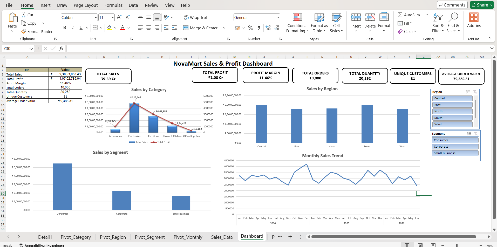

# NovaMart Sales & Profit Dashboard

A Microsoft Excel business analytics dashboard built from 10,000 NovaMart sales transactions to analyze sales, profitability, regional performance, customer segments, product categories, and monthly trends.

## Dashboard Preview

## Project Overview

NovaMart Sales & Profit Dashboard is a Microsoft Excel data analytics project focused on transforming raw sales data into an interactive business dashboard.

The dashboard provides a clear view of key business performance indicators and helps identify important sales and profitability patterns.

## Project Objective

The objective of this project is to transform raw sales data into an interactive Excel dashboard that helps analyze:

- Sales performance
- Profitability
- Product category performance
- Regional performance
- Customer segment contribution
- Monthly sales trends

## Dataset & Tools

**Dataset:** 10,000 NovaMart sales transactions

**Tool:** Microsoft Excel

**Techniques:**

- Data Cleaning
- Excel Formulas
- PivotTables
- PivotCharts
- KPI Analysis
- Data Visualization
- Dashboard Design

## Key Business Insights

- **Top Sales Category:** Electronics — approximately ₹4.83 crore
- **Top Region:** South — approximately ₹2.01 crore
- **Top Customer Segment:** Consumer — approximately ₹5.45 crore
- **Total Sales:** ₹9,38,53,053.43
- **Total Profit:** ₹1,07,52,789.04
- **Profit Margin:** 11.46%

## Dashboard Features

- Interactive Region and Segment slicers
- KPI cards for Sales, Profit, Profit Margin, Orders, Quantity, Customers, and Average Order Value
- Sales by Category analysis
- Sales by Region analysis
- Sales by Customer Segment
- Monthly Sales Trend
- Combined Sales & Profit visualization
- PivotTable and PivotChart-based analysis

## Skills Demonstrated

- Data Cleaning
- Excel Formulas
- PivotTables
- PivotCharts
- Data Visualization
- KPI Analysis
- Business Analysis
- Dashboard Design

## Project Files

| File                                   | Description                    |
| -------------------------------------- | ------------------------------ |
| `excel/NovaMart_Sales_Dashboard.xlsx`  | Complete Excel dashboard       |
| `excel/NovaMart_Dashboard_Preview.png` | Dashboard preview image        |
| `Project_Documentation.docx`           | Complete project documentation |

## Project Outcome

This project transforms raw sales data into an interactive Excel dashboard that provides decision-ready insights into sales, profitability, regional performance, customer segments, product categories, and monthly sales trends.

## Author

**Aniket Sharma — AS Creations**

Data Analytics • Web Development • UI/UX Design

GitHub: https://github.com/aniket040104
